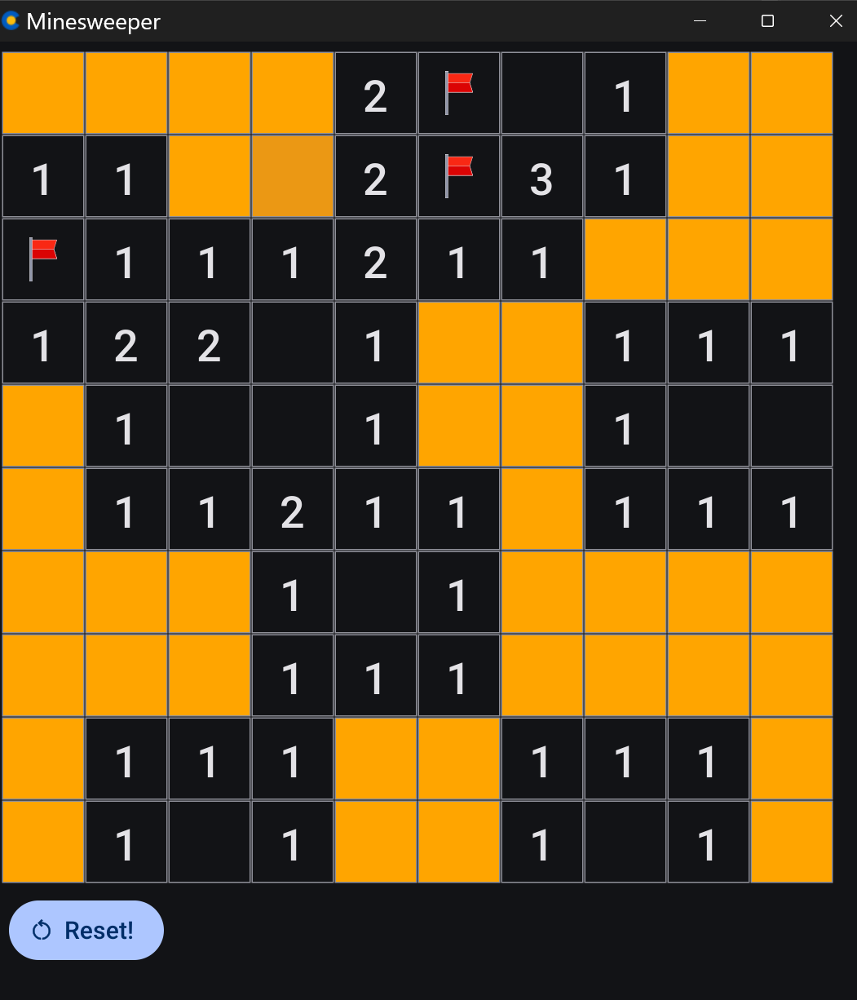

# Minesweeper Game

A GUI implementation of the classic Minesweeper game written in Go. Using Cogent Core

## Description

This project is a Go-based implementation of the classic Minesweeper game where players need to clear a board containing hidden mines without detonating them, using clues about the number of neighboring mines in each field.

## Features

*   Classic Minesweeper gameplay.
*   Graphical user interface powered by [Cogent Core](https://www.cogentcore.org/core).
*   Left-click to reveal cells.
*   Right-click or long press to toggle flags on suspected mine locations.
*   Visual indication of revealed numbers, mines (on game loss), and flags.
*   Win and Loss detection with notification messages (Snackbar).
*   "Reset" button to start a new game with the same dimensions and mine count.
*   **Safe First Click:** The first cell you interact with (left or right-click) is guaranteed not to be a mine. Mines are placed *after* your first interaction, avoiding that specific cell.
*   Uses embedded SVG icons for flags and mines.
*   Board dimensions and mine count are currently set in `main.go` (e.g., 10x10 with 10 mines).

## Screenshot



## Prerequisites

- Go 1.24 or higher
- Git (for version control)

## Installation

1. Clone the repository:
```bash
git clone [repository-url]
cd minesweepercogent

go build

```
## To run locally
./minesweepercogent

## To run on web via wasm

[Click here to Preview](http://htmlpreview.github.io/?https://github.com/fancellu/minesweepercogent/blob/main/bin/web/index.html)

## To build for web

Install core cli

```https://www.cogentcore.org/core/install```

```core build web```
